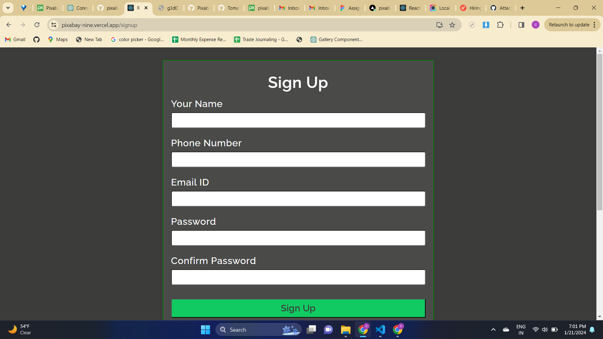

# Pixabay 
 
.


## Features

- **Sleek Single-Page Application:** Enjoy a seamless user experience within a single page, ensuring efficiency and smooth navigation.

- **Authentication Capabilities:** Utilize secure authentication features such as SignUp, Login, and Test Credentials to safeguard user data and ensure a safe environment.

- **Integrated React Date Component:** Benefit from the convenience of a React Date Component for easy and intuitive date selections within the application.

- **State Management with React Context and Reducer:** Employ React Context and Reducer to effectively manage the state of the application, enhancing user interaction and experience.

- **Dynamic Infinite Scrolling:** Implement Infinite Scroll functionality, allowing users to explore content continuously without interruptions.

- **Interactive Carousel for Categories:** Engage users with visually appealing carousels showcasing various categories, enhancing the presentation of content.

- **User-Friendly Dropdown Lists and Modals:** Improve user interaction with intuitive Dropdown Lists and Modals, ensuring a seamless and interactive interface.

- On the homepage, you will find the list of all the Images that were listed on the web app by hosts from all around the country. You can choose from various categories listed.

 

# All The Pages
- Individual Image Modal, here you'll find images for your need that select from small, medium, big and original images to download.

 

- In Wishlist Page you can store all the images.
 

-

 

-
 

## Tech Stack

**Client:** React, React-Router-Dom, React-Formik, React-Context API, HTML, CSS

## Author:

- Chandan Pratap
- [GitHub](https://github.com/Chandan8585)
- [LinkedIn](https://www.linkedin.com/in/chandan-pratap-464386154/)
- [Twitter](https://twitter.com/chandanpra25704)


# Live Link
# Frontend Link

https://pixabay-nine.vercel.app/

# Backend Link 
https://wicked-plum-sea-urchin.cyclic.cloud/


## Running the App Locally
To get started with this project on your local machine, follow these simple steps:

- Clone the project using the following command in your terminal. Ensure that you have Git installed and added to your system's path.

```bash
  git clone https://github.com/Chandan8585/pixabay.git
```

- Navigate to the project directory:
```bash
  cd pixabay
```
- Install the required dependencies:
```bash
  npm install
```
- Start the server:
```bash
  npm run dev
```


